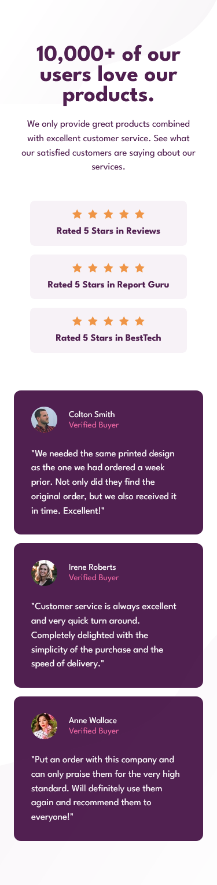
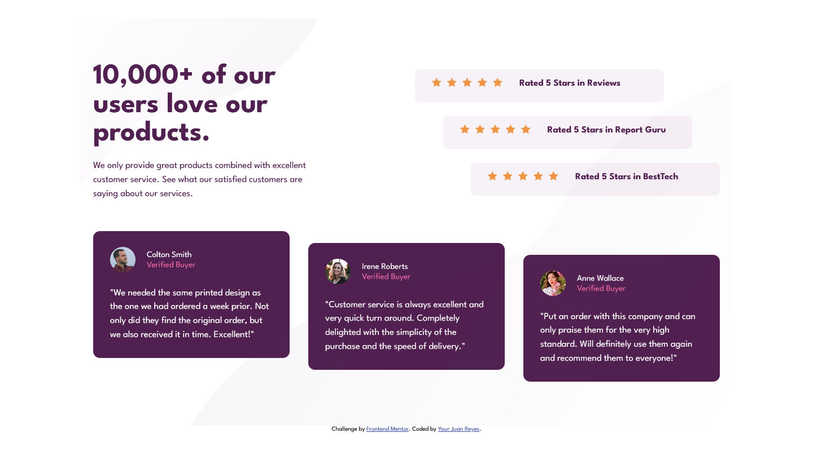

# Frontend Mentor - Social proof section


## Deploying your project

As mentioned above, there are many ways to host your project for free. Our recommended hosts are:

- [GitHub Pages](https://pages.github.com/)
- [Vercel](https://vercel.com/)
- [Netlify](https://www.netlify.com/)

You can host your site using one of these solutions or any of our other trusted providers. [Read more about our recommended and trusted hosts](https://medium.com/frontend-mentor/frontend-mentor-trusted-hosting-providers-bf000dfebe).

## Got feedback for us?

We love receiving feedback! We're always looking to improve our challenges and our platform. So if you have anything you'd like to mention, please email hi[at]frontendmentor[dot]io.

This challenge is completely free. Please share it with anyone who will find it useful for practice.


# Frontend Mentor - Social proof section solution

This is a solution to the [Social proof section challenge on Frontend Mentor](https://www.frontendmentor.io/challenges/social-proof-section-6e0qTv_bA). Frontend Mentor challenges help you improve your coding skills by building realistic projects. 

## Table of contents

- [Overview](#overview)
  - [The challenge](#the-challenge)
  - [Screenshot](#screenshot)
  - [Links](#links)
- [My process](#my-process)
  - [Built with](#built-with)
  - [What I learned](#what-i-learned)
  - [Continued development](#continued-development)
- [Author](#author)


## Overview
- Se trata de un reto algo más complejo que los anteriores que he tenido, pero básicamente tiene un header, con su título principal y un pequeño texto.

- Seguidamente tiene una serie de valoraciones sobre cierto puntos de nuestro negocio y por último hay una serie de tarjetas con usuarios verificados.

### The challenge

- La solución que he presentado solo tiene una consulta de medios. Debería ser al menos dos, pero he peleado mucho para llegar hasta aquí y estoy algo agotado.

- A la próxima lo haré mejor.

### Screenshot





### Links

- Solution URL: [Add solution URL here](https://github.com/juan-mentor/social-proof-section-master.git)
- Live Site URL: [Add live site URL here](https://juan-mentor.github.io/social-proof-section-master/)

## My process
- En este caso mi proceso ha sido algo caótico. Después de planificar como se distribuirían mis contenedores y que medidas tendrían. Me puse a construir el HTML, del que no me quejo.

- A la hora de construir el Css me dí cuenta que cuando lo planifiqué con flexbox, tuve una serie de pegas por no tener en cuenta el comportamiento de mi web en dispositivos intermedios. En ese aspecto tengo que mejorar y anticiparme a las posibles problemas que pueda tener y solucionarlos lo mejor posible.

### Built with

- Semantic HTML5 markup
- CSS custom properties
- Flexbox
- Mobile-first workflow 

### What I learned

- He aprendido que cuando el contenedor padre no tiene medidas de ancho concretas, y voy a posicionar la onda de fondo. Esta no responde a unidades de %, solamente a px, rem o em.

```html
<div class="bg-top">></div>
<div class="bg-bottom">></div>
```

```css
.bg-top {
  background-position: top right 20%;
  /* top right 180px si funciona. */
}
```

### Continued development

- Está claro que debería mejorar a la hora de entender las propiedades de `background`.

- Y seguir experimentando con flexbox.

## Author

- Frontend Mentor - [@juan-mentor](https://www.frontendmentor.io/profile/juan-mentor)